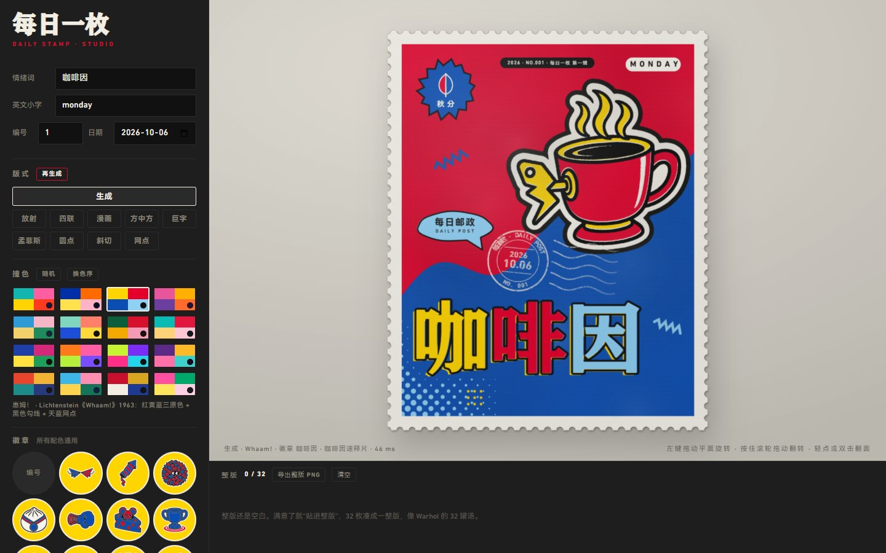
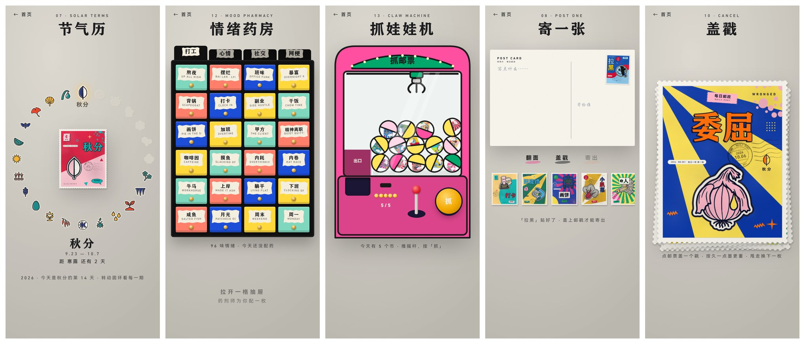

<div align="center">

# 每日一枚 · Daily Stamp

**一天一枚波普邮票。正面是吵闹的撞色，背面是一本正经的「情绪药品说明书」。**

中文 · [English](README.en.md) · [在线试玩](https://daily-stamp.netlify.app)


</div>

每日一枚是一个纯前端的网页小应用，手机和电脑都能玩。

- 首页是一圈转不到头的邮票，每一枚通往一个功能，一共 24 个。
- 邮票是在浏览器里现印的：96 个情绪词、16 套撞色、10 种版式，每次打开发到你手里的都不一样。
- 每枚邮票翻过来是一份「情绪药品说明书」：成分、适应症、不良反应、禁忌，一样不少。
- 运行时不调用任何模型，也没有后端，打包出来就是一个静态网站。

在线试玩：<https://daily-stamp.netlify.app>（备用：<https://daily-stamp.daily-stamp-2.workers.dev>）。
第一次打开要等一会儿，因为它会在加载界面后面把首页的 24 枚邮票全部印好。

## 目录

- [截图](#截图)
- [美术风格：安静的纸，吵闹的邮票](#美术风格安静的纸吵闹的邮票)
- [交互：邮票转盘为什么滑起来顺](#交互邮票转盘为什么滑起来顺)
- [24 个功能](#24-个功能)
- [在本地运行](#在本地运行)
- [开发](#开发)
- [许可证](#许可证)

## 截图

**首页的转盘**（左：手指滑动、轻点后邮票飞进功能页；中：另一套插画；右：加载界面开门之后）

<p align="center">
  
  &nbsp;
  
  &nbsp;
  
</p>

**加载界面**：一间小邮局的门。挂牌显示进度，印好之后轻触，门向里推开。


**邮票的正面和背面**


**同一台印刷机印出来的六枚**


**工作室**：自己选词、版式、撞色和徽章，印一枚存下来。



**几个功能页**：节气历、情绪药房、抓娃娃机、寄一张、盖戳。



## 美术风格：安静的纸，吵闹的邮票

整个应用只有一个美术上的想法：**周围的一切都安静、哑光、留白，只有邮票是吵的。**
牛皮纸、米色的墙、灰色的桌面都在往后退，高饱和的撞色只出现在那一小块带齿孔的纸上。

### 邮票正面：波普

邮票是用 Canvas 画出来的，不是图片。画法照着丝网印刷来：

- **16 套撞色**（`web/core/colors.js`）。每套是四个专色加一个墨色，每一套都有出处：
  Warhol 的《Shot Marilyns》和金宝汤罐、Lichtenstein 的《Whaam!》、Hockney 的泳池、
  Barragán 的吉拉迪之家、孟菲斯小组、马蒂斯晚年的剪纸、田中一光的《日本舞踊》、永井博的 City Pop 封面、
  《花样年华》的红配绿……四个颜色按「底色、撞色、高光、第四色」分配角色，角色可以轮换，所以一套配色能印出四种样子。
- **10 种版式**（`web/core/layouts.js`）：放射、四联、漫画、方中方、巨字、孟菲斯、圆点、斜切、网点，
  外加一个每次重新组合的「生成」版式。每种对应一种波普语汇。
- **图案库**（`web/core/pattern.js`）：放射线、Ben-Day 网点、条纹、棋盘格、草间弥生式圆点、漫画爆炸框、对话气泡、孟菲斯的波浪线和碎纸屑。
- **两块版**。每个版式都画在两块版上：色版（所有专色）和线版（黑色勾线）。
  印的时候线版故意错开一点，再盖一层纸的颗粒，所以它看起来是印的，不是屏幕上的矢量图。
- **徽章**。96 个词各有一枚徽章，每一枚都是这个词的视觉双关（「牛马」是挂着工牌的牛，「班味」是冒着味道的领带）。
  徽章存成不带颜色的三通道蒙版（深色墨、洋红、青），到了浏览器里再用当前配色上色，所以任何徽章都能配任何一套撞色。
  外面再长出一圈模切的白边，像一张贴纸。
- 邮票上还有当天的日期戳和当季的节气图标，24 个节气各画了一个。

### 邮票背面：情绪药品说明书

翻过来是药品说明书的版式：彩色的抬头、OTC 标志、成分比例条、性状、适应症、用法用量、不良反应、禁忌、贮藏、批准文号、条形码。
内容是一本正经的冷幽默，例如「加班缓释片」的成分是未读邮件 35%、冷掉的饭 25%、电梯余光 15%……每个词一份，都是提前写好存在 `leaflets/` 里的。

### 首页：牛皮纸、水粉小画、旧邮票

- **桌面是一张揉过的牛皮纸**，上面有几幅绘本风格的水粉小画。
  小画有两套，每次打开随机抽一套：「邮差」（骑车的邮差、追着跑的男孩、小猫、邮筒、路灯和长椅、叼着信的鸽子）
  和「乡间邮局」（小邮局、邮政车、寄信的孩子、热气球和双翼飞机）。
  画是印在纸上的：合成时让纸的起伏从颜料下面透出来。
- **邮票是旧的**。首页的每一枚都像被人拿了很多年：纸泛黄，墨褪色发颗粒，再随机带两三种旧痕（揉皱、折痕、水渍、揭薄），
  而且不再平整：翘角、卷边、折角、半开的折痕、弯拱、起伏。
  这些做成 12 套与邮票内容无关的「做旧套件」，像发牌一样发给 24 枚邮票，每次打开重新发，相邻两枚不会旧得一样。
  只有首页的邮票是旧的。点开之后，邮票在飞向功能页的途中变回新的；飞回首页时再变旧。
- **字是印上去的**。首页所有的字都像用橡皮章印在牛皮纸上：墨不实，有漏印的小点，边缘发毛，墨里透着纸色。
- **插画给邮票让路**。应用先算出邮票在整个转动过程中会经过的所有位置，插画只画在邮票永远不会经过的地方，
  在那里尽量画大；屏幕太小放不下的就不画，不硬塞。

### 加载界面：小邮局的门

米色的纸上，一辆车筐里装着信的自行车靠在红色的门边，旁边是一个旧邮筒和一只三花猫。画法像文学杂志的插图：平涂的哑光色、干而发颗粒的边缘、大片留白、没有五官的人物。

- 挂牌显示印刷进度（上墨、制版、晒版、印刷、调色、出版），每隔几秒有一封信从车筐飞进邮筒。
- 全部印好之后挂牌换成「营业中」，标题上盖下一枚当天的邮戳，门里的灯慢慢亮起来。
- 轻触，门向里推开，露出亮着灯的邮局：邮票柜、柜台、店员。再触一下，画面像光圈一样收拢，首页出现。

### 几条规矩

- 元素不突然出现，都是慢慢淡入。
- 交互保持克制，每样东西只轻轻地动一次。
- 不为了「提示用户」往画面里加网页控件。「进门」不是一个按钮，是门本身。
- 字体只用固定的几款，不随功能增加。

## 交互：邮票转盘为什么滑起来顺

首页的转盘是整个应用里打磨得最久的部分。下面按「形状、手感、细节、性能」的顺序写，最后是它一路改过来的过程。
代码都在 `web/shell/home.js`，不到 600 行，没有用任何动画库。

### 形状：一个轮心在屏幕下方的大轮子

邮票不是排成一条直线，而是骑在一个大轮子的边缘上。轮心远在屏幕下方（半径是屏幕宽度的 2 到 2.9 倍），
所以离中间越远的邮票位置越低、歪得越多、也越小。

- 中间那一枚最大，两边的依次缩小，最外面的一对被屏幕边缘切掉一半。这一半是有意留的：它告诉你旁边还有。
- 电脑上同时看到五枚，超宽屏七枚，手机上三枚。布局只按屏幕的宽高比分支，手机和电脑是同一套代码。
- 转盘没有尽头，24 枚首尾相接。

### 手感：一个数追另一个数

整个转盘的状态只有两个数：`pos`（现在转到哪，可以是小数）和 `to`（要转到哪）。每一帧 `pos` 向 `to` 靠近一点：

```js
pos += (to - pos) * (1 - Math.exp(-dt / 110));
```

这是按时间而不是按帧算的指数缓动，所以 60 Hz 和 120 Hz 的屏幕、掉帧和不掉帧，手感都一样。所有输入方式做的事情只有一件：改 `to`。

- **拖动**：手指按住时 `pos` 直接跟手，一像素对一像素。鼠标拖动的传动比降到 0.3，因为手在鼠标上一扫的距离比它本意大得多。
- **甩动**：松手时用最后 6 个采样点算出速度，把位置往前推 220 毫秒，再吸附到最近的一整枚上。
  一次最多甩过 3 枚，所以转盘不会转飞，也永远不会停在两枚之间。
- **滚轮**：鼠标滚轮一格走一枚。触控板一个手势走一枚，手势从事件停下来的那一刻算结束，所以惯性滚动不会连跳好几枚。
- **键盘**：左右方向键走一枚，回车或空格点开。
- **点击**：点旁边的邮票，它转到中间；点中间的邮票，它被点开。

### 细节

- **转动时邮票会侧一下身**。倾斜角度跟着转速走，最多 6 度，停下时自己回正。
- **邮票是飘着的**。每一枚都在上下浮动、沿一个慢 8 字游走、转动、朝光倾斜，五个动作各有各的周期（约 6.2、8.3、7.1、5.5、9.9 秒），
  每一枚的相位也不同，所以它们永远不会同步动。影子留在桌面上不跟着走：邮票飘得越高，影子越淡、越远。
- **按下去有分量**。按住中间的邮票，它会朝手指的方向倾斜并微微下沉（Windows 8 磁贴的那种反馈），影子同时收紧。
- **点开是一次飞行**。邮票先从桌面上抬起一点、微微一转，再飞到功能页里它该在的位置，途中由旧变新。
  返回时反过来，飞回它在转盘上的那一格，落下并重新变旧。浏览器的后退键走的也是这条路。
- **标题逐字换**。转到下一枚时，旧名字一个字一个字向上淡出，新名字一个字一个字从基线下面升上来。

### 性能：转动的时候，什么都不重画

顺滑的关键只有一句话：**转动过程中，每一帧只改图层的位置和透明度，不画任何东西**。所有要画的东西都提前画好了。

- 首页的 24 枚邮票、它们的做旧、每一个字，全部在加载界面后面印完。加载界面存在的意义就在这里：进来之后不再有东西加载、卡顿或突然冒出来。
- 影子是画一次的位图（按四分之一尺寸画），不是每帧计算的 CSS 模糊。
- 桌面（牛皮纸和插画）只在布局确定时画一次，画进一张 canvas。转动时绝不重画。
- 字是印一次的位图。会动的东西上不用实时的 CSS filter、mask、blend。
- 转出屏幕的邮票直接从页面上拿掉。
- 每一帧只在数值真的变了的时候才去写样式。
- 帧循环只在有东西在动的时候才跑。只剩漂浮在动时降到每秒 30 个姿势。
- 做旧的像素计算放在 Web Worker 里，主线程不等它。
- 静止的图层都落在整数像素上。
- 内存：每枚邮票只有一张 canvas；功能页在第一次点开时才构建，只保留最近打开的 6 个。

### 一路改过来的过程

转盘的样子参考的是 [jfa-awards.snp.agency](https://jfa-awards.snp.agency) 首页的轮播：中间一张大的，两边缩小并被屏幕边缘切掉。
搬过来之后在真机上一项一项改，下面是改动的大致顺序，大多能在提交历史里找到：

1. **影子**。最早每枚邮票的影子是实时模糊，一转动就掉帧。改成每种尺寸只画一次的位图。
2. **桌面**。最早的桌面会跟着中间那枚邮票变色，划过一枚就要重新上色一次。去掉了，桌面只画一次。
3. **字**。牛皮纸上的印字最早是用 CSS 的 filter、mask 和 blend 叠出来的，效果是对的，但页面每画一帧都要全部重算一遍，手机吃不消。
   改成加载时把每个词印成一张小位图，之后页面只移动位图。
4. **漂浮**。邮票的漂浮最早是循环播放的 CSS 动画。在 iPhone 上，只要页面上没有别的东西在变，这些动画就会定住不动，转一下转盘才醒过来。
   改成由帧循环来摆每一枚邮票的姿势。
5. **划动时让漂浮停一下**。改成帧循环之后，iPhone 上划动反而不如以前顺，因为每隔一帧就要给所有邮票摆一次姿势。
   于是手指按在转盘上、或者转盘转得快的时候，漂浮暂停，它的时钟也一起停；转盘慢下来之后从停下的地方接着飘，看不出断点。
6. **整数像素**。标题升起来落定的那一下，在 iPhone 上会横向滑一小下。原因是居中算出来的位置带小数，
   文字在独立图层上移动时和落回页面后被取整的方向不一样。改成居中时就取整到整数像素。
7. **内存**。iPhone 上内存一高页面就会被系统重载。每枚邮票原来有两份画布，改成一份；
   工作室的徽章按钮原来要解码 64 个词的大图，改成用预先切好的小图。

## 24 个功能

| | | | |
|---|---|---|---|
| 01 今日一枚 | 02 撕一张 | 03 泡票 | 04 放大镜鉴定 |
| 05 集邮册 | 06 月度小版张 | 07 节气历 | 08 寄一张 |
| 09 时光信 | 10 盖戳 | 11 刻章 | 12 情绪药房 |
| 13 抓娃娃机 | 14 邮票大头贴 | 15 丝网印刷机 | 16 复印机 |
| 17 拼贴机 | 18 八音盒 | 19 小票打印机 | 20 徽章机 |
| 21 剪纸窗花 | 22 万花筒 | 23 翻牌显示屏 | 24 刮刮乐 |

功能清单只有一份：`web/app/features.js`。首页转盘、页码和加载界面都从它读。工作室从「今日一枚」里进。

## 在本地运行

需要 Python 3.10 以上，以及 Pillow、numpy、scipy、fontTools。

```
pip install pillow numpy scipy fonttools
python dailystamp.py serve          # 打开 http://127.0.0.1:8765
python dailystamp.py serve --lan    # 同一 WiFi 下的手机、平板也能打开，启动时打印局域网地址
python dailystamp.py serve --keep   # 保留浏览器里的使用记录
```

- 调试阶段每次启动服务器都是一次清零：每个浏览器在服务器重启后第一次打开时，会清空之前的集邮册、撕一张、时光信等记录（`web/boot.js`）。不想清就加 `--keep`。
- Windows 上可以双击 `lan-start.bat` 在后台启动局域网服务，双击 `lan-stop.bat` 关闭。
- **字体**：仓库里带的是切好的中文字体子集（`web/fonts/sub/`）。两款拉丁字体（DIN Next、Arial Black）的原始文件不在仓库里，
  缺了它们英文小字会回退到系统字体。想要和线上完全一样，把你有授权的字体文件放进 `web/fonts/`，文件名见 `web/css/base.css` 和 `dailystamp/webfonts.py`。

网址参数（截图和调试用）：

- `?homeseed=7`：固定首页这一次发的牌。
- `?gallery=1`：一次看 6 枚生成结果，加 `&layout=tpl` 轮换版式。
- `?phrase=咖啡因&palette=Whaam!&seed=42&side=back`：直接打开工作室。
- `?sheet=demo`：整版样张。
- `?fps`：在角落显示帧率，适合在手机上试。

## 开发

### 打包和部署

```
python dailystamp.py build                       # 在 dist/ 里生成一份静态网站
python dailystamp.py deploy [cloudflare|netlify] # 打包并上传
```

### 素材是怎么来的

应用运行时从不调用模型。所有图片素材都是开发时用本机的 `codex` CLI 画好、再由 Python 脚本切好存进仓库的：

```
python dailystamp.py words [词…] [--redo]        # 画 dailystamp/words.py 里还没有徽章的词，再补说明书
python dailystamp.py emblem "躺平" --idea "…"     # 往库里添一个徽章
python dailystamp.py leaflets [词…]              # 补写背面说明书
python dailystamp.py terms | posters | backdrops  # 节气图标 / 撕一张的海报 / 剪纸底纹
python dailystamp.py scene | kraft | agekits      # 加载界面的画 / 首页的牛皮纸和插画 / 做旧套件
python dailystamp.py masks [--force]             # 预切徽章和节气图标的色版和轮廓
python dailystamp.py fonts                       # 改了文案或说明书后重做网页字体子集
```

codex 生图一次只跑一个，并行时会互相拿错图。

### 目录

```
dailystamp.py            命令行入口（表驱动的子命令）
dailystamp/              开发期工具和本地服务器
  server.py build.py     静态文件和 /api；打包、部署
  library.py words.py    徽章库；词表、分柜和每个词固定的图案
  emblem.py leaflet.py   codex 画徽章、写说明书
  scene.py kraft.py agekit.py   加载界面的画；首页的牛皮纸、插画和印字墨版；做旧套件
  cutmasks.py webfonts.py       预切色版；网页字体子集
web/
  index.html loader.js   页面和加载界面
  core/                  邮票引擎：配色、图案、版式、邮票、整版、节气。只画图，不碰应用状态
  shell/                 首页转盘（home）、桌面（desk）、印字（type）、做旧（age）、页面框架、公共件（kit）、集邮册存储
  pages/<key>.js/.css    每个功能一对文件
  app/                   功能清单、共享状态、印刷、今日一枚和工作室、路由（在首页和各页之间飞邮票）、预载
emblems/ leaflets/ terms/ posters/ scene/ kraft/ backdrops/   生成好的素材
docs/screenshots/        本页用的截图
```

### 加一个功能

1. 在 `web/app/features.js` 加一行 `{ key, cn, en }`：首页转盘、页码、加载界面的空位都会跟着变。
2. 新建 `web/pages/<key>.js`：`Pages.define(key, (root, deps) => …)`，开头用 `Kit.page(root, key, layout)` 拿到页头、状态行和屏幕尺寸，
   返回 `P.api({ ready, anchor, source, receive?, enter?, leave? })`。
3. 新建 `web/pages/<key>.css`，在 `index.html` 里挂上两个文件。
4. 有次数限制的功能，用 `Kit.debugRow(root).add('…', fn)` 给一个调试恢复按钮。
5. 改了中文文案后跑一次 `python dailystamp.py fonts`。

## 许可证

- **代码**（`dailystamp.py`、`dailystamp/`、`web/` 里的 JS、CSS、HTML）：[MIT](LICENSE)。
- **美术和文字**（`emblems/`、`leaflets/`、`terms/`、`posters/`、`scene/`、`kraft/`、`backdrops/`、`docs/screenshots/`，以及应用里的文案）：
  [CC BY-NC 4.0](LICENSE-ART.md)。可以转载和改编，需要署名，不能商用。
- **第三方**：`web/vendor/` 里的 [egjs Axes](https://github.com/naver/egjs-axes) 是 MIT 许可。
  `web/fonts/` 里的字体归各自的厂商所有，不在上面两个许可的范围内。

转盘的形式参考了 [jfa-awards.snp.agency](https://jfa-awards.snp.agency)。
